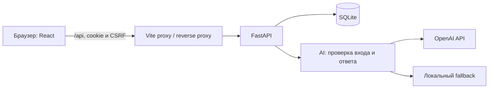

# Qadam · От задачи к результату

Проект команды **Bul Bul Corp** для хакатона HackAlem, кейс AI Sana.

## 1. Название проекта

**Qadam** помогает бизнесу и студенческим командам пройти путь от первоначальной потребности до принятого результата.

## 2. Какую проблему решает проект

Бизнес часто начинает с общего описания: «Обращения клиентов теряются между отделами». Команде неясно, кто будет пользоваться решением, какие данные доступны и как проверять результат.

Qadam помогает собрать эти сведения в задачу, показывает её готовность и открывает её для предложений студентов. Бизнес получает понятную карточку и отклики, а команды получают контекст для выбора и выполнения проекта.

Основные пользователи: представители бизнеса и студенческие команды. Следующая аудитория для пилота: университетские центры практики.

## 3. Что реализовано

- Регистрация бизнеса и команды, вход, выход, серверные сессии и смена пароля.
- Собственный редактируемый профиль и просмотр публичных профилей. Email для входа не публикуется.
- Создание черновика из свободного описания потребности.
- От трёх до пяти уточняющих вопросов, сборка карточки из ответов и ручное редактирование всех 11 полей.
- Отдельные действия подтверждения сведений и публикации.
- Рейтинг готовности от 0 до 100 с расшифровкой и списком недостающих сведений.
- Каталог с фильтрами по теме и готовности и сортировкой по рейтингу.
- Предложения команд: идея, план, срок и необязательная ссылка на прототип.
- Кабинет бизнеса со всеми своими задачами и предложениями. Каждую команду можно выбрать или отклонить независимо от остальных.
- Кабинет команды со статусами, отправкой этапа и пересдачей после доработки.
- Подтверждение результата бизнесом и однократное начисление 10 баллов за этап.
- Адаптивный интерфейс, сообщения об ошибках и локальные черновики карточек и предложений.
- Серверная проверка прав: пользователь не может изменять чужие задачи, предложения и результаты.

Рейтинг оценивает **подготовленность конкретной задачи**, а не известность компании. Низкий балл не скрывает опубликованную задачу и не запрещает отклик.

| Категория | Максимум |
|---|---:|
| Контекст и потребность | 20 |
| Данные и материалы | 20 |
| Ожидаемый результат | 15 |
| Измеримые критерии успеха | 15 |
| Ограничения | 10 |
| Пользователи | 10 |
| Контакт и формат взаимодействия | 10 |
| **Итого** | **100** |

До подтверждения сведения не дают баллов. Изменение карточки снимает её текущее подтверждение. Каталог сохраняет последнюю опубликованную версию до повторного подтверждения и публикации.

## 4. Как работает решение

1. Бизнес входит и описывает проблему своими словами.
2. Помощник задаёт вопросы о недостающих сведениях.
3. Ответы попадают в редактируемую карточку. Автор проверяет и подтверждает её.
4. Сервер рассчитывает рейтинг и объясняет, какие сведения его повысят.
5. Бизнес отдельно публикует задачу в каталоге.
6. Команда выбирает задачу и отправляет предложение.
7. Бизнес рассматривает предложения и выбирает одну, несколько или ни одной команды.
8. Выбранная команда отправляет результат этапа. Бизнес принимает его или возвращает с комментарием.
9. После принятия команда получает 10 баллов. Повторное подтверждение того же этапа не удваивает начисление.

AI не назначает исполнителей и не подтверждает сведения за пользователя.

## 5. Технологии

| Компонент | Технологии |
|---|---|
| Frontend | TypeScript, React 19, React Router 7, Vite 8 |
| Интерфейс | CSS, локальный шрифт Manrope, SVG-иконки |
| Backend | Python, FastAPI, Uvicorn, Pydantic |
| Хранение | SQLite |
| AI | OpenAI Python SDK, OpenAI API или совместимый endpoint |
| Модель по умолчанию | `gpt-4o-mini`, настраивается через `AI_MODEL` |
| Конфигурация | python-dotenv, переменные окружения |
| Проверки | unittest, FastAPI TestClient, HTTPX, TypeScript и Vite build |

При отсутствии ключа или некорректном ответе провайдера работает локальный помощник. Интерфейс показывает источник ответа. Это резервная логика, а не локально запущенная языковая модель.

## 6. Архитектура проекта



Frontend отображает серверные статусы и баллы. FastAPI проверяет пользователя, права и переходы состояний, хранит данные и рассчитывает рейтинг. AI-модуль помогает с вопросами и карточкой; ответ проверяется до применения.

```text
frontend/
  src/app/             маршруты, сессия, общие поля и локальные черновики
  src/features/        вход, профили, конструктор, каталог и кабинеты
  src/api/             типы ответов и HTTP-клиент
  src/styles.css       оформление и адаптивность
backend/
  main.py              API, хранение и пользовательский процесс
  auth.py              пароли, cookie-сессии, CSRF и права
  ai.py                промпты, вызовы AI, проверка ответа и fallback
  rating.py            объяснимый рейтинг готовности
  schemas.py           схемы задач, предложений и этапов
  account_schemas.py   схемы аккаунтов и профилей
  seed.py              демонстрационные данные
  test_*.py            автоматические проверки
fixtures/              синтетические задачи, команды и предложения
```

Пароли хешируются PBKDF2 с солью. Сессия хранится на сервере; браузер получает HttpOnly-cookie. Изменяющие запросы защищены CSRF. Проверка роли в интерфейсе дополняется серверной проверкой владельца.

Технические контракты для разработчиков: [основной API](backend/CONTRACT.md), [аккаунты и профили](backend/ACCOUNTS.md), [OpenAPI](backend/openapi.json).

## 7. Установка и запуск

Нужны Git, Python 3.11+ и Node.js 22.12+. Проверенная среда: Windows, Python 3.14, Node.js 22.22.3 и npm 10.9.8. Команды используют только пути внутри проекта.

Получите интегрированную версию:

```sh
git clone https://github.com/BAITC-Hacks/hack-f035d723-bul-bul-corp.git
cd hack-f035d723-bul-bul-corp
```

### Терминал 1: backend

Windows PowerShell:

```powershell
py -m venv .venv
.\.venv\Scripts\python.exe -m pip install -r backend/requirements.txt
if (!(Test-Path .env)) { Copy-Item .env.example .env }
.\.venv\Scripts\python.exe -m backend.seed
.\.venv\Scripts\python.exe -m uvicorn backend.main:app --host 127.0.0.1 --port 8000
```

macOS/Linux:

```sh
python3 -m venv .venv
.venv/bin/python -m pip install -r backend/requirements.txt
test -f .env || cp .env.example .env
.venv/bin/python -m backend.seed
.venv/bin/python -m uvicorn backend.main:app --host 127.0.0.1 --port 8000
```

Seed добавляет демонстрационные записи без удаления пользовательских задач. Данные сохраняются в `backend/sana.sqlite3`; другой файл можно задать через `DATABASE_PATH`.

### Терминал 2: frontend

Из корня репозитория:

```sh
cd frontend
npm ci
npm run dev
```

Откройте **[http://127.0.0.1:5173](http://127.0.0.1:5173)**. Оба терминала должны оставаться запущенными.

Браузер обращается к `/api` на том же адресе. Vite перенаправляет запросы на backend. Если порт 8000 занят, запустите backend на другом порту и создайте `frontend/.env.local`:

```dotenv
SANA_BACKEND_URL=http://127.0.0.1:8018
```

Перезапустите Vite после изменения файла. При использовании прокси не задавайте `VITE_API_BASE_URL`.

### Настройка AI

Для запуска без внешнего AI оставьте `AI_API_KEY` пустым и не задавайте `OPENAI_API_KEY`. Включится fallback. Для вызовов модели укажите новый действующий ключ в корневом `.env`:

```dotenv
AI_API_KEY=
AI_MODEL=gpt-4o-mini
AI_BASE_URL=https://api.openai.com/v1
AI_TIMEOUT_SECONDS=15
DEMO_MODE=false
FRONTEND_ORIGINS=http://localhost:5173,http://127.0.0.1:5173
COOKIE_SECURE=false
```

Значения выше рассчитаны на локальный показ. Ключи не должны попадать в Git или frontend. Внешний AI требует интернет-соединения и доступного лимита провайдера.

### Проверка сборки

Из `frontend`:

```sh
npm run build
npm run preview -- --port 5173
```

Перед preview остановите dev-сервер на том же порту. Preview тоже перенаправляет `/api` на backend. Для публичного размещения потребуется HTTPS, reverse proxy и отдача `dist/index.html` для маршрутов frontend.

## 8. Как проверить решение

### Повторяемый сценарий для жюри

Подготовьте два аккаунта с разными email: бизнес и команду. Пароль должен содержать минимум 12 символов. Демо-профили из seed не имеют общих паролей для входа. Используйте два отдельных профиля браузера либо выходите перед сменой аккаунта; вкладки одного профиля разделяют cookie.

1. В аккаунте бизнеса откройте **Создать задачу**. Введите: «Обращения клиентов теряются между отделами». Тема: «Поддержка клиентов».
2. Создайте черновик и запросите вопросы. Должно появиться не менее трёх вопросов. Ответьте на них и добавьте ответы в карточку.
3. Дополните карточку следующими сведениями:

   | Поле | Демонстрационное значение |
   |---|---|
   | Контекст | Операторы вручную пересылают обращения между отделами |
   | Пользователи | Операторы поддержки и руководитель отдела |
   | Данные | Синтетический CSV с 500 обращениями и категориями |
   | Ограничения | Две недели, без персональных данных |
   | Результат | Прототип классификации обращений и инструкция запуска |
   | Критерии успеха | Точность классификации не менее 90% |
   | Контакт | owner@example.com |
   | Взаимодействие | Еженедельный созвон и обратная связь по почте |

4. Подтвердите сведения. Посмотрите рейтинг, категории и причины начисления. Затем отдельно опубликуйте задачу.
5. В аккаунте команды найдите задачу в каталоге. Отправьте идею, план и срок. Обновите страницу: предложение должно сохраниться.
6. В аккаунте бизнеса откройте **Мои задачи → Предложения**. Посмотрите профиль команды и выберите её.
7. В аккаунте команды откройте **Моя работа**. Отправьте описание этапа и ссылку, например `https://example.com/demo-result`. Это демонстрационная ссылка, а не реальный результат разработки.
8. Бизнес возвращает этап с комментарием. Команда исправляет описание и пересдаёт. Бизнес подтверждает результат.
9. В кабинете команды должны появиться **10 баллов**, сохраняющиеся после обновления.
10. Измените опубликованную карточку. До повторного подтверждения и публикации каталог должен показывать прежнюю версию.

Для выступления на четыре минуты заранее подготовьте аккаунты и текст ответов. Покажите проблему, уточнение и рейтинг, затем отклик и принятый результат. Основную ценность объясняйте на этом примере, а не перечнем технологий.

### Автоматические проверки

Из корня проекта, Windows:

```powershell
.\.venv\Scripts\python.exe -m unittest discover -s backend -t .
```

macOS/Linux:

```sh
.venv/bin/python -m unittest discover -s backend -t .
```

Результаты проверки интегрированной версии 23.09.2026:

- **58 backend-тестов прошли**, frontend собирается через `npm run build`.
- В браузере пройден путь от регистрации и черновика до отклика, выбора, возврата, пересдачи и подтверждения этапа.
- Проверены сохранение предложения и 10 баллов после обновления, редактирование профиля, сохранение старой публикации до повторного подтверждения.
- Каталог проверен на ширине 1440 и 390 px без горизонтального переполнения.
- Последний браузерный прогон использовал fallback. Он не является повторной проверкой внешнего AI.
- Права, CSRF и защита от повторного начисления проверены backend-тестами. Все сочетания сетевых сбоев, Storage и клавиатурной навигации вручную не воспроизводились.

Снимки интерфейса: [desktop](.impeccable/review/desktop.png), [mobile](.impeccable/review/mobile.png).

## 9. Данные и интеграции

В `fixtures/demo-data.json` находятся пять черновиков, пять опубликованных карточек и пять предложений. `fixtures/demo-identities.json` содержит демонстрационные профили, включая пять команд с интересами, навыками и технологиями. Это синтетические данные.

Пользовательские задачи, аккаунты, предложения, этапы и сессии хранятся в SQLite. Черновики полей карточки и предложения могут храниться в браузере отдельно для профиля и задачи; при выходе они очищаются.

Единственная внешняя продуктовая интеграция: AI API. Сервер передаёт провайдеру текст задачи и ответов, нужный для уточнения или сборки карточки. При локальном fallback эти вызовы не выполняются. Не вводите чувствительные сведения в демонстрационные задачи.

Промпты, формат входа и выхода и обработка некорректных ответов доступны в [backend/ai.py](backend/ai.py). Проверки поведения провайдера находятся в [backend/test_ai.py](backend/test_ai.py). Собственная ML-модель не обучалась.

## 10. Ограничения и дальнейшее развитие

- Рейтинг использует лексические правила. Он может не распознать корректную формулировку метрики и не доказывает правдивость сведений или достижимость результата. Пользователь видит причины оценки.
- Fallback поддерживает рабочий сценарий, но не заменяет языковую модель. Для внешнего AI нужен действующий ключ.
- Нет восстановления пароля по email, приглашений в команды, чата, уведомлений и файлового хранилища.
- Результат этапа передаётся ссылкой; платформа не проверяет содержимое внешнего сайта автоматически.
- SQLite и локальный запуск рассчитаны на MVP. Производственное развёртывание, резервное копирование и нагрузочная проверка не выполнены.
- Интервью с клиентами, коммерческий пилот и измерение экономического эффекта ещё не проводились. Уникальность на рынке и отсутствие аналогов не заявляются.
- Основную механику геймификации задал кейс хакатона. В проекте она реализована как связный процесс с объяснимым рейтингом, опубликованными версиями, аккаунтами и приёмкой этапов.
- **Старый AI-ключ попадал в историю Git. Его отзыв владельцем остаётся необходимым.** Удаление ключа из текущих файлов не устраняет историческую утечку.

Следующий шаг: пилот с одним университетским центром практики и несколькими компаниями. Проверяемые показатели: время подготовки задачи, число повторных уточнений, доля задач с откликом и доля принятых этапов. Это план проверки, а не достигнутые показатели.

Для роста нужны участие в организациях, уведомления, PostgreSQL, изоляция данных, резервные копии и наблюдение за работой сервиса.

## 11. Развёрнутая версия

Подтверждённой публичной deployed-версии сейчас нет. Адрес `127.0.0.1:5173` доступен только на компьютере, где запущен проект.

[Репозиторий, итоговая ветка main](https://github.com/BAITC-Hacks/hack-f035d723-bul-bul-corp/tree/main). В ней объединены frontend и backend, включая исправления `882c69b` и аккаунты `4e64bf0`.
